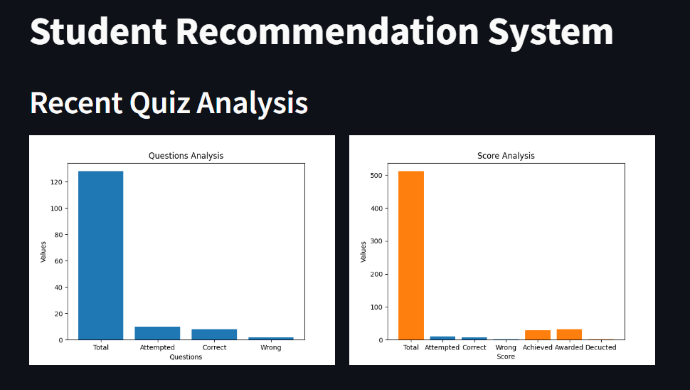
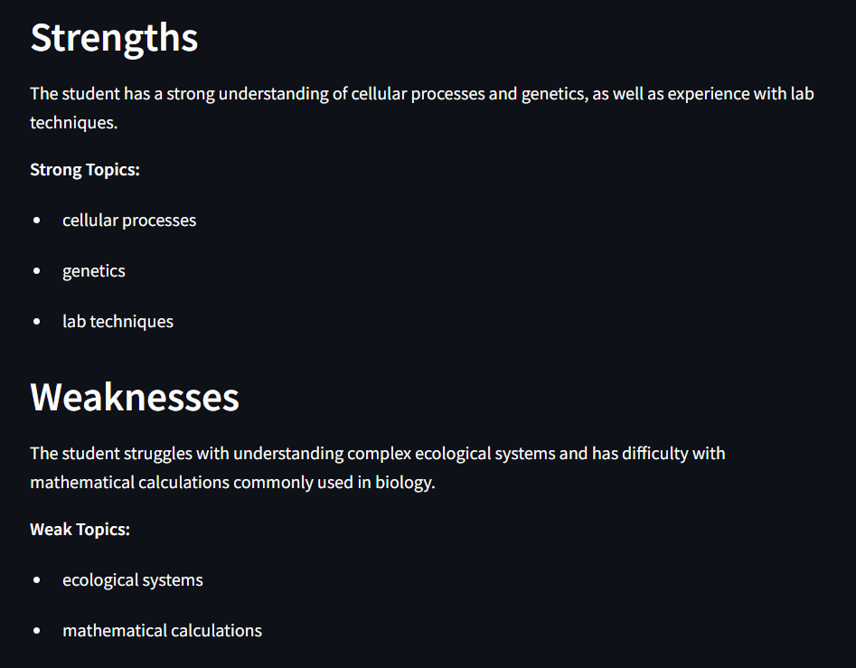
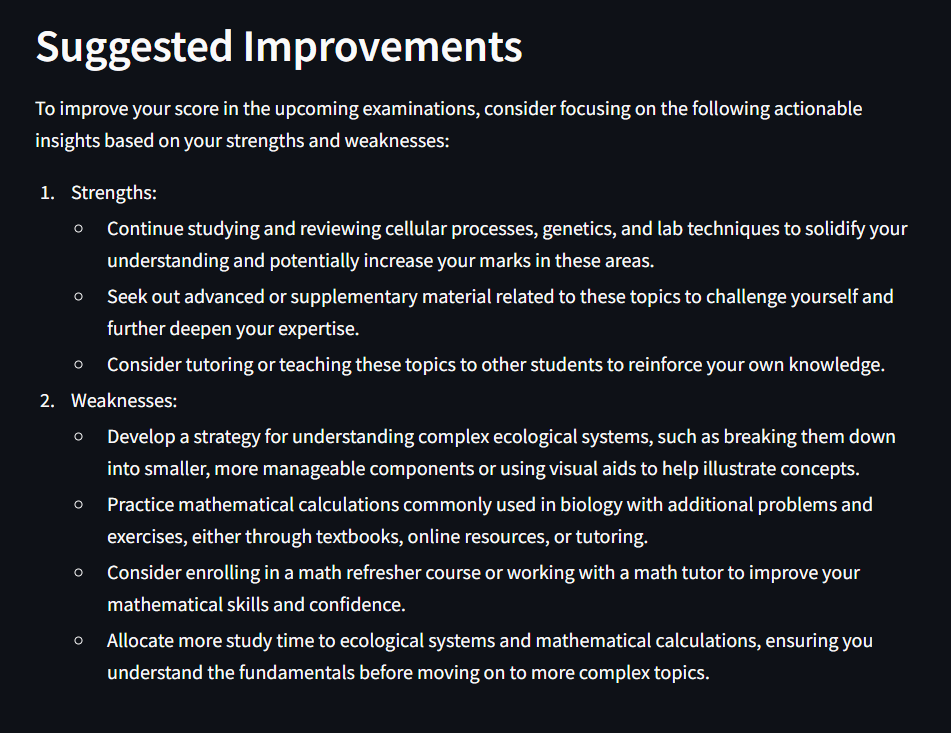

# Personalized-Student-Recommendation-System
This is a personalized student recommendation system which is able to offer you insights about your strengths and weaknesses according to the quiz submitted by you.

Project Structure:
This project has three main files that can be found in the src folder. 
The data ingestion file gets the data from the APIs and stores it into data/raw drectory.
S_W file (strengths_weaknesses) uses this data to first match the correct and incorrect answers given by the user to the quiz questions using response_map. This data is then passed to an llm to get more insights about the students strengths and weaknesses.
Finally the visualizations file creates some plots which are used in the streamlit application
the main.py file is responsible for running our streamlit application and for computing the recommendations for the user.

This is the structure:

Project Setup:
To setup this project locally, follow the following instructions:

1. Clone this repository into a virtual or gloabal python environment.
2. Pip install the requirements.txt file
3. Login at groq.com and go to https://console.groq.com/keys
4. get your api key and paste it in the sample.env file after renaming it as .env

Using DVC:
5. Initialize DVC using the command "dvc init"
6. Run the YAML file using the command "dvc repro"

This will automatically run all files in order and a stremlit application should be launched.

Manually:
5. Run Data_Ingestion.py then S_W.py and then Visualizations.py from the src folder.
6. Run main.py

This will launch a streamlit application in your browser.

Deployment:
After deployment you will see three types of insights:

Plots:

Strengths and Weaknesses:

Suggested Improvements:

